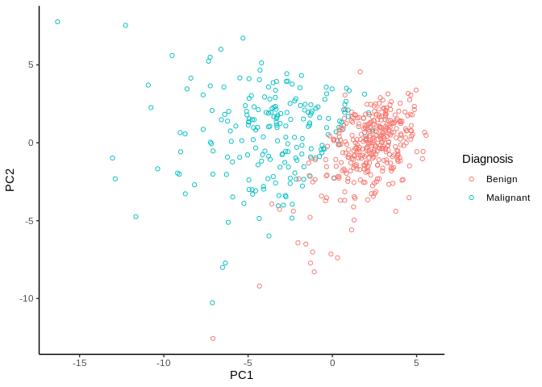
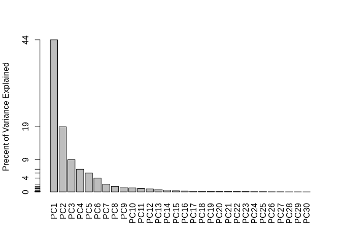
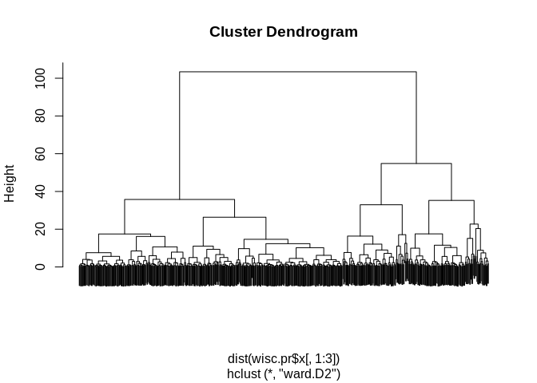
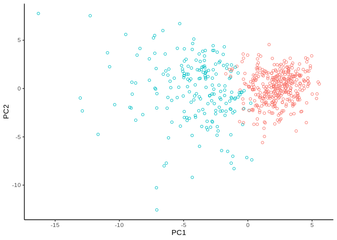
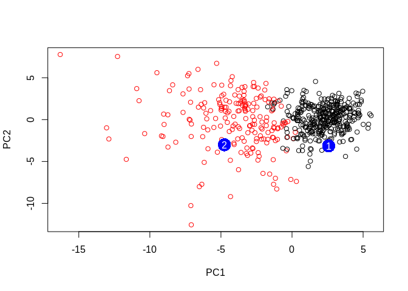

Analysis of Human Breast Cancer Data
================
Vikas Gubbala
2/6/2020

Importing the data into R

``` r
library(ggplot2)

fna.data <- "data/WisconsinCancer.csv"
wisc.df <- read.csv("data/WisconsinCancer.csv")

new <- read.csv("data/new_samples.csv")
```

Preparing the Data

``` r
wisc.data <- as.matrix(wisc.df[,3:32])
row.names(wisc.data) <- wisc.df$id
diagnosis <- wisc.df[,2]

head(wisc.data)
```

    ##          radius_mean texture_mean perimeter_mean area_mean smoothness_mean
    ## 842302         17.99        10.38         122.80    1001.0         0.11840
    ## 842517         20.57        17.77         132.90    1326.0         0.08474
    ## 84300903       19.69        21.25         130.00    1203.0         0.10960
    ## 84348301       11.42        20.38          77.58     386.1         0.14250
    ## 84358402       20.29        14.34         135.10    1297.0         0.10030
    ## 843786         12.45        15.70          82.57     477.1         0.12780
    ##          compactness_mean concavity_mean concave.points_mean symmetry_mean
    ## 842302            0.27760         0.3001             0.14710        0.2419
    ## 842517            0.07864         0.0869             0.07017        0.1812
    ## 84300903          0.15990         0.1974             0.12790        0.2069
    ## 84348301          0.28390         0.2414             0.10520        0.2597
    ## 84358402          0.13280         0.1980             0.10430        0.1809
    ## 843786            0.17000         0.1578             0.08089        0.2087
    ##          fractal_dimension_mean radius_se texture_se perimeter_se area_se
    ## 842302                  0.07871    1.0950     0.9053        8.589  153.40
    ## 842517                  0.05667    0.5435     0.7339        3.398   74.08
    ## 84300903                0.05999    0.7456     0.7869        4.585   94.03
    ## 84348301                0.09744    0.4956     1.1560        3.445   27.23
    ## 84358402                0.05883    0.7572     0.7813        5.438   94.44
    ## 843786                  0.07613    0.3345     0.8902        2.217   27.19
    ##          smoothness_se compactness_se concavity_se concave.points_se
    ## 842302        0.006399        0.04904      0.05373           0.01587
    ## 842517        0.005225        0.01308      0.01860           0.01340
    ## 84300903      0.006150        0.04006      0.03832           0.02058
    ## 84348301      0.009110        0.07458      0.05661           0.01867
    ## 84358402      0.011490        0.02461      0.05688           0.01885
    ## 843786        0.007510        0.03345      0.03672           0.01137
    ##          symmetry_se fractal_dimension_se radius_worst texture_worst
    ## 842302       0.03003             0.006193        25.38         17.33
    ## 842517       0.01389             0.003532        24.99         23.41
    ## 84300903     0.02250             0.004571        23.57         25.53
    ## 84348301     0.05963             0.009208        14.91         26.50
    ## 84358402     0.01756             0.005115        22.54         16.67
    ## 843786       0.02165             0.005082        15.47         23.75
    ##          perimeter_worst area_worst smoothness_worst compactness_worst
    ## 842302            184.60     2019.0           0.1622            0.6656
    ## 842517            158.80     1956.0           0.1238            0.1866
    ## 84300903          152.50     1709.0           0.1444            0.4245
    ## 84348301           98.87      567.7           0.2098            0.8663
    ## 84358402          152.20     1575.0           0.1374            0.2050
    ## 843786            103.40      741.6           0.1791            0.5249
    ##          concavity_worst concave.points_worst symmetry_worst
    ## 842302            0.7119               0.2654         0.4601
    ## 842517            0.2416               0.1860         0.2750
    ## 84300903          0.4504               0.2430         0.3613
    ## 84348301          0.6869               0.2575         0.6638
    ## 84358402          0.4000               0.1625         0.2364
    ## 843786            0.5355               0.1741         0.3985
    ##          fractal_dimension_worst
    ## 842302                   0.11890
    ## 842517                   0.08902
    ## 84300903                 0.08758
    ## 84348301                 0.17300
    ## 84358402                 0.07678
    ## 843786                   0.12440

``` r
#head(diagnosis)
```

Exploratory Data
Analysis

``` r
print(paste("Number of rows = ", nrow(wisc.data)))
```

    ## [1] "Number of rows =  569"

``` r
print(paste("Number of malignant samples = ", sum(diagnosis == "M")))
```

    ## [1] "Number of malignant samples =  212"

``` r
print(paste("Number of avg characteristics = ", sum(grepl("_mean", colnames(wisc.data)))))
```

    ## [1] "Number of avg characteristics =  10"

Performing PCA

``` r
wisc.pr <- prcomp(wisc.data, scale = TRUE)
#summary(wisc.pr)
```

From the results it seems that 99% of variation can be explained by PC1
captures 44% of the variation in the original data set, and PC2 captures
19%. Three PCs are required to capture 70% of the variance of the
original dataset, and seven PCs are required to capture 90% of the
variance.

Interpreting PCA results

``` r
pr_df <- as.data.frame(wisc.pr$x)
pr_df$group <- diagnosis
plot <- ggplot(pr_df,aes(x=PC1,y=PC2,color=group)) + geom_point(pch = 1) + theme_classic() + scale_colour_discrete(name = "Diagnosis", breaks = c("B", "M"), labels = c("Benign", "Malignant"))
plot
```

<!-- -->

Explaining Variance

``` r
pr.var = wisc.pr$sdev^2
pve <- pr.var / sum(pr.var)

#pve_plot <- ggplot(as.data.frame(pve)) + geom_bar()
#pve_plot

barplot(pve, ylab = "Precent of Variance Explained",
     names.arg=paste0("PC",1:length(pve)), las=2, axes = FALSE)
axis(2, at=pve, labels=round(pve,2)*100 )
```

<!-- -->

Communicating PCA Results

``` r
#finish this part!
```

Clustering in PC Space

``` r
#Dendrogram Clustering
wisc.pr.hclust = hclust(dist(wisc.pr$x[,1:3]), method = "ward.D2")
plot(wisc.pr.hclust, labels = FALSE)
```

<!-- -->

``` r
groups <- cutree(wisc.pr.hclust, k=2)
table(groups, diagnosis)
```

    ##       diagnosis
    ## groups   B   M
    ##      1  24 179
    ##      2 333  33

``` r
#Graphing PCA by dendrogram clustering
wisc.pr.hclust = hclust(dist(wisc.pr$x[,1:3]), method = "ward.D2")
groups <- cutree(wisc.pr.hclust, k=2)
table(groups, diagnosis)
```

    ##       diagnosis
    ## groups   B   M
    ##      1  24 179
    ##      2 333  33

``` r
plot <- ggplot(pr_df,aes(x=PC1,y=PC2)) + geom_point(pch = 1) + theme_classic() + scale_colour_discrete(name = "Diagnosis", breaks = c("B", "M"), labels = c("Benign", "Malignant"))
g <- as.factor(3-groups)
plot + aes(color = g)
```

<!-- -->

Specificity Versus Sensitivity

Minimizing FPs and FNs by altering clustering method, linkage method.

Prediction

``` r
npc <- predict(wisc.pr, newdata=new)
npc
```

    ##            PC1       PC2        PC3        PC4       PC5        PC6        PC7
    ## [1,]  2.576616 -3.135913  1.3990492 -0.7631950  2.781648 -0.8150185 -0.3959098
    ## [2,] -4.754928 -3.009033 -0.1660946 -0.6052952 -1.140698 -1.2189945  0.8193031
    ##             PC8       PC9       PC10      PC11      PC12      PC13     PC14
    ## [1,] -0.2307350 0.1029569 -0.9272861 0.3411457  0.375921 0.1610764 1.187882
    ## [2,] -0.3307423 0.5281896 -0.4855301 0.7173233 -1.185917 0.5893856 0.303029
    ##           PC15       PC16        PC17        PC18        PC19       PC20
    ## [1,] 0.3216974 -0.1743616 -0.07875393 -0.11207028 -0.08802955 -0.2495216
    ## [2,] 0.1299153  0.1448061 -0.40509706  0.06565549  0.25591230 -0.4289500
    ##            PC21       PC22       PC23       PC24        PC25         PC26
    ## [1,]  0.1228233 0.09358453 0.08347651  0.1223396  0.02124121  0.078884581
    ## [2,] -0.1224776 0.01732146 0.06316631 -0.2338618 -0.20755948 -0.009833238
    ##              PC27        PC28         PC29         PC30
    ## [1,]  0.220199544 -0.02946023 -0.015620933  0.005269029
    ## [2,] -0.001134152  0.09638361  0.002795349 -0.019015820

``` r
plot(wisc.pr$x[,1:2], col=g)
points(npc[,1], npc[,2], col="blue", pch=16, cex=3)
text(npc[,1], npc[,2], c(1,2), col="white")
```

<!-- -->
