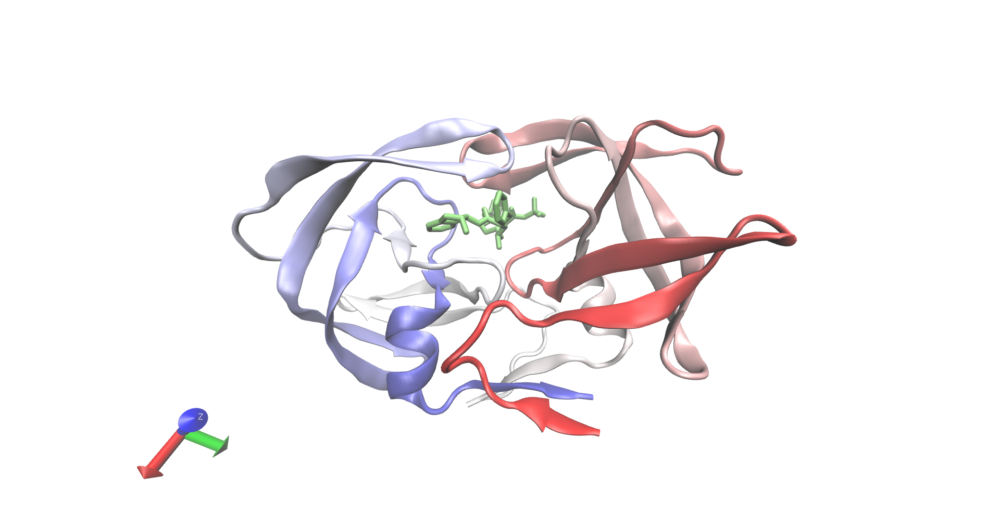

```{r setup, include=FALSE}
knitr::opts_chunk$set(echo = TRUE)
```

In this exercise, we predict the best fit of a small molecule in the active site of 1-HSG. First, we import the necessary packages:


```{r}
library(bio3d)
```

## Visualizing HIV-1 protease '1HSG'.

First, we download and format the 1HSG PDB structure using functions from the Bio3D package. Examining the hsg PDB variable, we see that the file contains a protein, non-protein Merck drug, and non-protein water molecules. We trim the PDB file into the protein and ligand, for future ease. 

```{r}
hsg <- read.pdb(get.pdb('1hsg', path = 'pdbs/'))
protein <- trim.pdb(hsg, "protein")
ligand <- trim.pdb(hsg, "ligand")

write.pdb(protein, file = "pdbs/1hsg_protein.pdb")
write.pdb(ligand, file = "pdbs/1hsg_ligand.pdb")
```

The software VMD can be used to visualize the protein ligand pair.


Figure 1 - Graphical representation of X-ray crystallography data of HIV-1 bound to drug MK-1


We can also inspect the `hsg` object:
```{r}
hsg
```

## In Silico drug docking to HIV-1 protease '1HSG'.

The protein and ligand files were prepared for docking using MGLTools. A .pdbqt file was generated, adding hydrogens, atom types, and charges onto the base pdb file.

Drug docking was performed by Autodock Vina, and the output was written to all.pdbqt. We will now convert all.pdbqt to a PDB file for visualization in VMD.

```{r}
res <- read.pdb("pdbqts/all.pdbqt", multi = TRUE)
write.pdb(res, "pdbs/results.pdb")
```

In order to assess quality of the docs, we will calculate root mean squared distance.

```{r}
ori <- read.pdb("pdbqts/ligand.pdbqt")
rmsd(ori, res)
```

