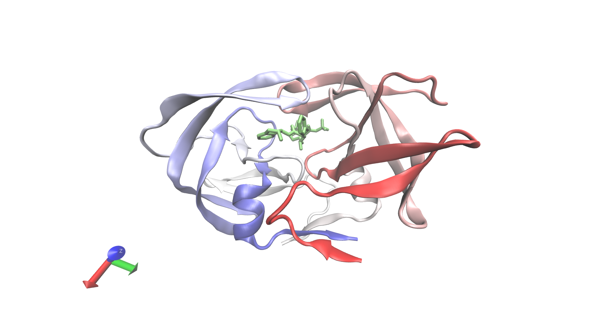

Drug Binding Prediction for HIV-1 Protease
================
Vikas Gubbala
2/18/2020

In this exercise, we predict the best fit of a small molecule in the
active site of 1-HSG. First, we import the necessary packages:

``` r
library(bio3d)
```

## Visualizing HIV-1 protease ‘1HSG’.

First, we download and format the 1HSG PDB structure using functions
from the Bio3D package. Examining the hsg PDB variable, we see that the
file contains a protein, non-protein Merck drug, and non-protein water
molecules. We trim the PDB file into the protein and ligand, for future
ease.

``` r
hsg <- read.pdb(get.pdb('1hsg', path = 'pdbs/'))
```

    ## Warning in get.pdb("1hsg", path = "pdbs/"): pdbs//1hsg.pdb exists. Skipping
    ## download

``` r
protein <- trim.pdb(hsg, "protein")
ligand <- trim.pdb(hsg, "ligand")

write.pdb(protein, file = "pdbs/1hsg_protein.pdb")
write.pdb(ligand, file = "pdbs/1hsg_ligand.pdb")
```

The software VMD can be used to visualize the protein ligand pair.

 Figure 1 - Graphical representation of X-ray
crystallography data of HIV-1 bound to drug MK-1

We can also inspect the `hsg` object:

``` r
hsg
```

    ## 
    ##  Call:  read.pdb(file = get.pdb("1hsg", path = "pdbs/"))
    ## 
    ##    Total Models#: 1
    ##      Total Atoms#: 1686,  XYZs#: 5058  Chains#: 2  (values: A B)
    ## 
    ##      Protein Atoms#: 1514  (residues/Calpha atoms#: 198)
    ##      Nucleic acid Atoms#: 0  (residues/phosphate atoms#: 0)
    ## 
    ##      Non-protein/nucleic Atoms#: 172  (residues: 128)
    ##      Non-protein/nucleic resid values: [ HOH (127), MK1 (1) ]
    ## 
    ##    Protein sequence:
    ##       PQITLWQRPLVTIKIGGQLKEALLDTGADDTVLEEMSLPGRWKPKMIGGIGGFIKVRQYD
    ##       QILIEICGHKAIGTVLVGPTPVNIIGRNLLTQIGCTLNFPQITLWQRPLVTIKIGGQLKE
    ##       ALLDTGADDTVLEEMSLPGRWKPKMIGGIGGFIKVRQYDQILIEICGHKAIGTVLVGPTP
    ##       VNIIGRNLLTQIGCTLNF
    ## 
    ## + attr: atom, xyz, seqres, helix, sheet,
    ##         calpha, remark, call

## In Silico drug docking to HIV-1 protease ‘1HSG’.

The protein and ligand files were prepared for docking using MGLTools. A
.pdbqt file was generated, adding hydrogens, atom types, and charges
onto the base pdb file.

Drug docking was performed by Autodock Vina, and the output was written
to all.pdbqt. We will now convert all.pdbqt to a PDB file for
visualization in VMD.

``` r
res <- read.pdb("all.pdbqt", multi = TRUE)
write.pdb(res, "results.pdb")
```

In order to assess quality of the docs, we will calculate root mean
squared distance.

``` r
ori <- read.pdb("ligand.pdbqt")
rmsd(ori, res)
```

    ##  [1]  0.691  4.150 11.130 10.555 10.972 11.007 10.712  5.499  2.766 10.732
    ## [11]  3.507  8.235  5.105 10.804 10.262
