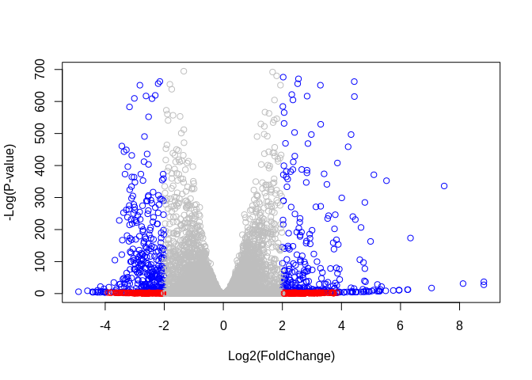
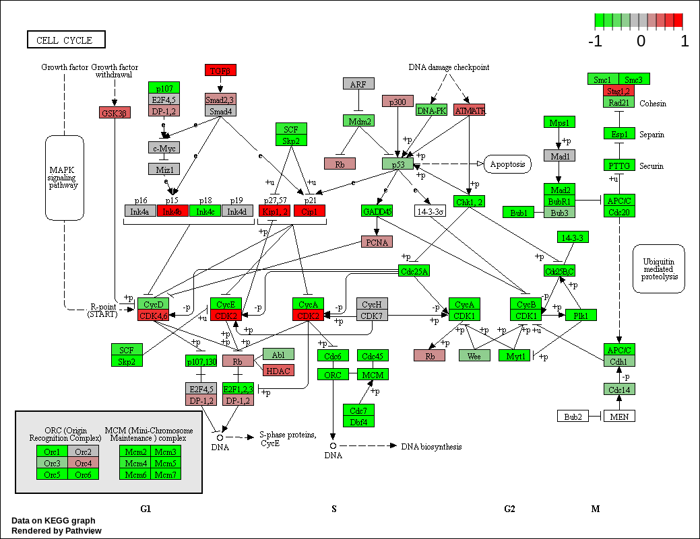

Differential Gene Expression and Pathway Analysis from RNA Sequencing
================
Vikas Gubbala
2/27/2020

The purpose of the following excercise is to take processed RNA
sequencing data and run differential gene expression analysis (DESeq2)
as well as pathway enrichment analysis (from KEGG, GO, Reactome).

``` r
#package fo dgea
library (DESeq2)
```

    ## Loading required package: S4Vectors

    ## Loading required package: stats4

    ## Loading required package: BiocGenerics

    ## Loading required package: parallel

    ## 
    ## Attaching package: 'BiocGenerics'

    ## The following objects are masked from 'package:parallel':
    ## 
    ##     clusterApply, clusterApplyLB, clusterCall, clusterEvalQ,
    ##     clusterExport, clusterMap, parApply, parCapply, parLapply,
    ##     parLapplyLB, parRapply, parSapply, parSapplyLB

    ## The following objects are masked from 'package:stats':
    ## 
    ##     IQR, mad, sd, var, xtabs

    ## The following objects are masked from 'package:base':
    ## 
    ##     anyDuplicated, append, as.data.frame, basename, cbind, colnames,
    ##     dirname, do.call, duplicated, eval, evalq, Filter, Find, get, grep,
    ##     grepl, intersect, is.unsorted, lapply, Map, mapply, match, mget,
    ##     order, paste, pmax, pmax.int, pmin, pmin.int, Position, rank,
    ##     rbind, Reduce, rownames, sapply, setdiff, sort, table, tapply,
    ##     union, unique, unsplit, which, which.max, which.min

    ## 
    ## Attaching package: 'S4Vectors'

    ## The following object is masked from 'package:base':
    ## 
    ##     expand.grid

    ## Loading required package: IRanges

    ## Loading required package: GenomicRanges

    ## Loading required package: GenomeInfoDb

    ## Loading required package: SummarizedExperiment

    ## Loading required package: Biobase

    ## Welcome to Bioconductor
    ## 
    ##     Vignettes contain introductory material; view with
    ##     'browseVignettes()'. To cite Bioconductor, see
    ##     'citation("Biobase")', and for packages 'citation("pkgname")'.

    ## Loading required package: DelayedArray

    ## Loading required package: matrixStats

    ## 
    ## Attaching package: 'matrixStats'

    ## The following objects are masked from 'package:Biobase':
    ## 
    ##     anyMissing, rowMedians

    ## Loading required package: BiocParallel

    ## 
    ## Attaching package: 'DelayedArray'

    ## The following objects are masked from 'package:matrixStats':
    ## 
    ##     colMaxs, colMins, colRanges, rowMaxs, rowMins, rowRanges

    ## The following objects are masked from 'package:base':
    ## 
    ##     aperm, apply, rowsum

``` r
#packages for annotation
library("AnnotationDbi")
library("org.Hs.eg.db")
```

    ## 

``` r
#packages for pathway analysis
library(pathview)
```

    ## ##############################################################################
    ## Pathview is an open source software package distributed under GNU General
    ## Public License version 3 (GPLv3). Details of GPLv3 is available at
    ## http://www.gnu.org/licenses/gpl-3.0.html. Particullary, users are required to
    ## formally cite the original Pathview paper (not just mention it) in publications
    ## or products. For details, do citation("pathview") within R.
    ## 
    ## The pathview downloads and uses KEGG data. Non-academic uses may require a KEGG
    ## license agreement (details at http://www.kegg.jp/kegg/legal.html).
    ## ##############################################################################

``` r
library(gage)
library(gageData)
```

## RNA Sequencing Data

In this excercise, we process data from the publication “Trapnell C,
Hendrickson DG, Sauvageau M, Goff L et al.”Differential analysis of gene
regulation at transcript resolution with RNA-seq“. Nat Biotechnol 2013
Jan;31(1):46-53. PMID: 23222703”, with GEO number (GSE37704).

RNA sequencing was conducted on control lung fibroblasts and HOX1A
knockdown fibroblasts, with three technical replicates for each
condition.

``` r
metaFile <- "data/GSE37704_metadata.csv"
countFile <- "data/GSE37704_featurecounts.csv"

metadata <- read.csv(metaFile, row.names=1)
head(metadata)
```

    ##               condition
    ## SRR493366 control_sirna
    ## SRR493367 control_sirna
    ## SRR493368 control_sirna
    ## SRR493369      hoxa1_kd
    ## SRR493370      hoxa1_kd
    ## SRR493371      hoxa1_kd

``` r
counts <- read.csv(countFile, row.names=1)
counts <- as.matrix(counts[,-1]) #remove the length row
counts <- counts[rowSums(counts) !=0, ] # remove all rows with 0
head(counts)
```

    ##                 SRR493366 SRR493367 SRR493368 SRR493369 SRR493370 SRR493371
    ## ENSG00000279457        23        28        29        29        28        46
    ## ENSG00000187634       124       123       205       207       212       258
    ## ENSG00000188976      1637      1831      2383      1226      1326      1504
    ## ENSG00000187961       120       153       180       236       255       357
    ## ENSG00000187583        24        48        65        44        48        64
    ## ENSG00000187642         4         9        16        14        16        16

There are 15975 genes in our dataset.

## Differential Gene Expression Analysis

Now, we will run DGEA using the R package
DESeq.

``` r
dds <- DESeqDataSetFromMatrix(countData=counts, colData=metadata,design=~condition)
dds <- DESeq(dds)
```

    ## estimating size factors

    ## estimating dispersions

    ## gene-wise dispersion estimates

    ## mean-dispersion relationship

    ## final dispersion estimates

    ## fitting model and testing

``` r
res <- results(dds, contrast=c("condition", "hoxa1_kd", "control_sirna"))
res = res[order(res$pvalue),]
```

We will visualize significance and fold change of the differentially
expressed genes with a volcano plot.

``` r
cols <- rep("gray", nrow(res))
cols[abs(res$log2FoldChange)>2] <- "red"
cols[abs(res$log2FoldChange)>2 & res$padj < 0.05] <- "blue"

plot(res$log2FoldChange, -log(res$padj), col = cols, xlab="Log2(FoldChange)", ylab="-Log(P-value)")
```

<!-- -->

In our current dataframe we only have Ensemble annotation and gene ID,
but KEGG uses Entrez IDs. So we must add
    this.

``` r
columns(org.Hs.eg.db)
```

    ##  [1] "ACCNUM"       "ALIAS"        "ENSEMBL"      "ENSEMBLPROT"  "ENSEMBLTRANS"
    ##  [6] "ENTREZID"     "ENZYME"       "EVIDENCE"     "EVIDENCEALL"  "GENENAME"    
    ## [11] "GO"           "GOALL"        "IPI"          "MAP"          "OMIM"        
    ## [16] "ONTOLOGY"     "ONTOLOGYALL"  "PATH"         "PFAM"         "PMID"        
    ## [21] "PROSITE"      "REFSEQ"       "SYMBOL"       "UCSCKG"       "UNIGENE"     
    ## [26] "UNIPROT"

``` r
#adding the entrez
res$symbol = mapIds(org.Hs.eg.db, keys=row.names(res), keytype="ENSEMBL",column='SYMBOL', multiVals="first")
```

    ## 'select()' returned 1:many mapping between keys and columns

``` r
res$entrez = mapIds(org.Hs.eg.db, keys=row.names(res), keytype="ENSEMBL",column='ENTREZID', multiVals="first")
```

    ## 'select()' returned 1:many mapping between keys and columns

## Pathway Analysis with KEGG

We are going to use the gage package to get enriched pathways, and the
pathview package to draw diagrams.

``` r
data(kegg.sets.hs)
data(sigmet.idx.hs)

#subset to signalling and metabolic pathways
kegg.sets.hs = kegg.sets.hs[sigmet.idx.hs]
#head(kegg.sets.hs, 3)
```

``` r
#making an array with just the fold changes and entrez as the ID

foldchanges = res$log2FoldChange
names(foldchanges) = res$entrez
head(foldchanges)
```

    ##      1266     54855      1465     51232      2034      2317 
    ## -2.422719  3.201955 -2.313738 -2.059631 -1.888019 -1.649792

Now, we will run gage pathway analysis.

``` r
keggres = gage(foldchanges, gsets = kegg.sets.hs)

#attributes(keggres)

head(keggres$greater)
```

    ##                                         p.geomean stat.mean       p.val
    ## hsa04640 Hematopoietic cell lineage   0.002822776  2.833362 0.002822776
    ## hsa04630 Jak-STAT signaling pathway   0.005202070  2.585673 0.005202070
    ## hsa00140 Steroid hormone biosynthesis 0.007255099  2.526744 0.007255099
    ## hsa04142 Lysosome                     0.010107392  2.338364 0.010107392
    ## hsa04330 Notch signaling pathway      0.018747253  2.111725 0.018747253
    ## hsa04916 Melanogenesis                0.019399766  2.081927 0.019399766
    ##                                           q.val set.size        exp1
    ## hsa04640 Hematopoietic cell lineage   0.3893570       55 0.002822776
    ## hsa04630 Jak-STAT signaling pathway   0.3893570      109 0.005202070
    ## hsa00140 Steroid hormone biosynthesis 0.3893570       31 0.007255099
    ## hsa04142 Lysosome                     0.4068225      118 0.010107392
    ## hsa04330 Notch signaling pathway      0.4391731       46 0.018747253
    ## hsa04916 Melanogenesis                0.4391731       90 0.019399766

``` r
head(keggres$less)
```

    ##                                          p.geomean stat.mean        p.val
    ## hsa04110 Cell cycle                   8.995727e-06 -4.378644 8.995727e-06
    ## hsa03030 DNA replication              9.424076e-05 -3.951803 9.424076e-05
    ## hsa03013 RNA transport                1.375901e-03 -3.028500 1.375901e-03
    ## hsa03440 Homologous recombination     3.066756e-03 -2.852899 3.066756e-03
    ## hsa04114 Oocyte meiosis               3.784520e-03 -2.698128 3.784520e-03
    ## hsa00010 Glycolysis / Gluconeogenesis 8.961413e-03 -2.405398 8.961413e-03
    ##                                             q.val set.size         exp1
    ## hsa04110 Cell cycle                   0.001448312      121 8.995727e-06
    ## hsa03030 DNA replication              0.007586381       36 9.424076e-05
    ## hsa03013 RNA transport                0.073840037      144 1.375901e-03
    ## hsa03440 Homologous recombination     0.121861535       28 3.066756e-03
    ## hsa04114 Oocyte meiosis               0.121861535      102 3.784520e-03
    ## hsa00010 Glycolysis / Gluconeogenesis 0.212222694       53 8.961413e-03

As an example, we will look at the gene set labelled “Cell
    Cycle.”

``` r
pathview(gene.data=foldchanges, pathway.id="hsa04110")
```

    ## 'select()' returned 1:1 mapping between keys and columns

    ## Info: Working in directory /mnt/vdata/vikas/Documents/R-Projects/bimm143_github/pathway

    ## Info: Writing image file hsa04110.pathview.png

``` r
#PDF Output
#pathview(gene.data=foldchanges, pathway.id="hsa04110", kegg.native=FALSE)

#iterated 
#keggrespathways <- rownames(keggres$greater)[1:5]
#keggresids = substr(keggrespathways, start=1, stop=8)
#pathview(gene.data=foldchanges, pathway.id=keggresids, species="hsa")
```

``` r

```


## Gene Ontology

``` r
data(go.sets.hs)
data(go.subs.hs)

# subset by biological processes
gobpsets = go.sets.hs[go.subs.hs$BP]
gobpres = gage(foldchanges, gsets=gobpsets, same.dir=TRUE)

head(gobpres$greater)
```

    ##                                              p.geomean stat.mean        p.val
    ## GO:0007156 homophilic cell adhesion       8.519724e-05  3.824205 8.519724e-05
    ## GO:0002009 morphogenesis of an epithelium 1.396681e-04  3.653886 1.396681e-04
    ## GO:0048729 tissue morphogenesis           1.432451e-04  3.643242 1.432451e-04
    ## GO:0007610 behavior                       2.195494e-04  3.530241 2.195494e-04
    ## GO:0060562 epithelial tube morphogenesis  5.932837e-04  3.261376 5.932837e-04
    ## GO:0035295 tube development               5.953254e-04  3.253665 5.953254e-04
    ##                                               q.val set.size         exp1
    ## GO:0007156 homophilic cell adhesion       0.1952430      113 8.519724e-05
    ## GO:0002009 morphogenesis of an epithelium 0.1952430      339 1.396681e-04
    ## GO:0048729 tissue morphogenesis           0.1952430      424 1.432451e-04
    ## GO:0007610 behavior                       0.2244344      427 2.195494e-04
    ## GO:0060562 epithelial tube morphogenesis  0.3712298      257 5.932837e-04
    ## GO:0035295 tube development               0.3712298      391 5.953254e-04

``` r
head(gobpres$less)
```

    ##                                             p.geomean stat.mean        p.val
    ## GO:0048285 organelle fission             1.536227e-15 -8.063910 1.536227e-15
    ## GO:0000280 nuclear division              4.286961e-15 -7.939217 4.286961e-15
    ## GO:0007067 mitosis                       4.286961e-15 -7.939217 4.286961e-15
    ## GO:0000087 M phase of mitotic cell cycle 1.169934e-14 -7.797496 1.169934e-14
    ## GO:0007059 chromosome segregation        2.028624e-11 -6.878340 2.028624e-11
    ## GO:0000236 mitotic prometaphase          1.729553e-10 -6.695966 1.729553e-10
    ##                                                 q.val set.size         exp1
    ## GO:0048285 organelle fission             5.843127e-12      376 1.536227e-15
    ## GO:0000280 nuclear division              5.843127e-12      352 4.286961e-15
    ## GO:0007067 mitosis                       5.843127e-12      352 4.286961e-15
    ## GO:0000087 M phase of mitotic cell cycle 1.195965e-11      362 1.169934e-14
    ## GO:0007059 chromosome segregation        1.659009e-08      142 2.028624e-11
    ## GO:0000236 mitotic prometaphase          1.178690e-07       84 1.729553e-10

## Reactome Analysis

Reactome contains information about biological molecules in their
relationship to pathways. Here, we will just output a list of
signficantly overexpressed genes and use the online Reactome website
(<https://reactome.org/PathwayBrowser/#TOOL=AT>).

``` r
sig_genes <- res[res$padj <= 0.05 & !is.na(res$padj), "symbol"]
write.table(sig_genes, file="significant_genes.txt", row.names=FALSE, col.names=FALSE, quote=FALSE)
```

## Session Information

``` r
sessionInfo()
```

    ## R version 3.6.2 (2019-12-12)
    ## Platform: x86_64-pc-linux-gnu (64-bit)
    ## Running under: Linux Mint 19.2
    ## 
    ## Matrix products: default
    ## BLAS:   /usr/lib/x86_64-linux-gnu/blas/libblas.so.3.7.1
    ## LAPACK: /usr/lib/x86_64-linux-gnu/lapack/liblapack.so.3.7.1
    ## 
    ## locale:
    ##  [1] LC_CTYPE=en_US.UTF-8       LC_NUMERIC=C              
    ##  [3] LC_TIME=en_US.UTF-8        LC_COLLATE=en_US.UTF-8    
    ##  [5] LC_MONETARY=en_US.UTF-8    LC_MESSAGES=en_US.UTF-8   
    ##  [7] LC_PAPER=en_US.UTF-8       LC_NAME=C                 
    ##  [9] LC_ADDRESS=C               LC_TELEPHONE=C            
    ## [11] LC_MEASUREMENT=en_US.UTF-8 LC_IDENTIFICATION=C       
    ## 
    ## attached base packages:
    ## [1] parallel  stats4    stats     graphics  grDevices utils     datasets 
    ## [8] methods   base     
    ## 
    ## other attached packages:
    ##  [1] gageData_2.24.0             gage_2.36.0                
    ##  [3] pathview_1.26.0             org.Hs.eg.db_3.10.0        
    ##  [5] AnnotationDbi_1.48.0        DESeq2_1.26.0              
    ##  [7] SummarizedExperiment_1.16.1 DelayedArray_0.12.2        
    ##  [9] BiocParallel_1.20.1         matrixStats_0.55.0         
    ## [11] Biobase_2.46.0              GenomicRanges_1.38.0       
    ## [13] GenomeInfoDb_1.22.0         IRanges_2.20.2             
    ## [15] S4Vectors_0.24.3            BiocGenerics_0.32.0        
    ## 
    ## loaded via a namespace (and not attached):
    ##  [1] httr_1.4.1             bit64_0.9-7            splines_3.6.2         
    ##  [4] Formula_1.2-3          latticeExtra_0.6-29    blob_1.2.1            
    ##  [7] GenomeInfoDbData_1.2.2 yaml_2.2.1             pillar_1.4.3          
    ## [10] RSQLite_2.2.0          backports_1.1.5        lattice_0.20-38       
    ## [13] digest_0.6.24          RColorBrewer_1.1-2     XVector_0.26.0        
    ## [16] checkmate_2.0.0        colorspace_1.4-1       htmltools_0.4.0       
    ## [19] Matrix_1.2-18          XML_3.99-0.3           pkgconfig_2.0.3       
    ## [22] genefilter_1.68.0      zlibbioc_1.32.0        xtable_1.8-4          
    ## [25] scales_1.1.0           jpeg_0.1-8.1           htmlTable_1.13.3      
    ## [28] tibble_2.1.3           annotate_1.64.0        KEGGREST_1.26.1       
    ## [31] ggplot2_3.2.1          nnet_7.3-12            lazyeval_0.2.2        
    ## [34] survival_3.1-8         magrittr_1.5           crayon_1.3.4          
    ## [37] KEGGgraph_1.46.0       memoise_1.1.0          evaluate_0.14         
    ## [40] foreign_0.8-75         graph_1.64.0           tools_3.6.2           
    ## [43] data.table_1.12.8      lifecycle_0.1.0        stringr_1.4.0         
    ## [46] locfit_1.5-9.1         munsell_0.5.0          cluster_2.1.0         
    ## [49] Biostrings_2.54.0      compiler_3.6.2         rlang_0.4.4           
    ## [52] grid_3.6.2             RCurl_1.98-1.1         rstudioapi_0.11       
    ## [55] htmlwidgets_1.5.1      bitops_1.0-6           base64enc_0.1-3       
    ## [58] rmarkdown_2.1          gtable_0.3.0           DBI_1.1.0             
    ## [61] R6_2.4.1               gridExtra_2.3          knitr_1.28            
    ## [64] bit_1.1-15.2           Hmisc_4.3-1            Rgraphviz_2.30.0      
    ## [67] stringi_1.4.6          Rcpp_1.0.3             geneplotter_1.64.0    
    ## [70] vctrs_0.2.3            rpart_4.1-15           acepack_1.4.1         
    ## [73] png_0.1-7              xfun_0.12
