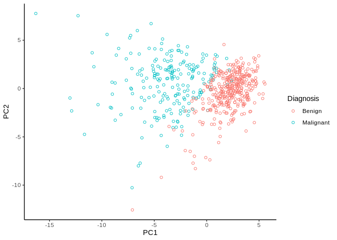
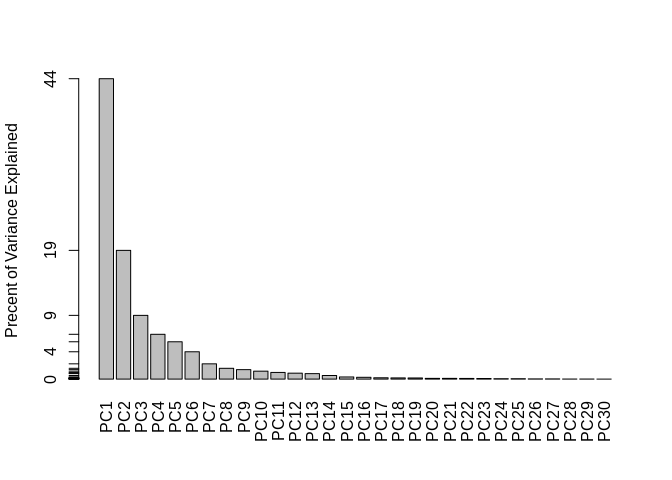
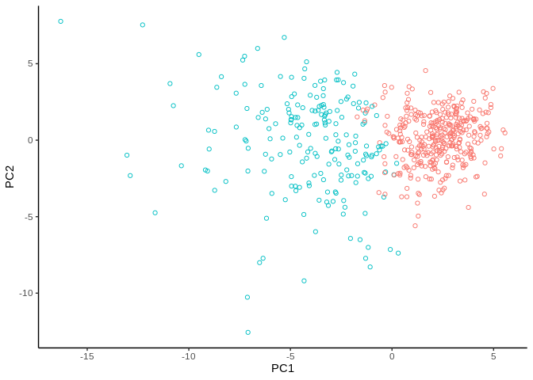

Analysis of Human Breast Cancer Data
================
Vikas Gubbala
2/6/2020

## Description

In this exercise, we will apply unsupervised learning to human breast
cancer data in order to predict malignancy from epithelial cell
morphologies.

Principal component analysis (PCA) will be performed on the dataset, and
dendrogram clustering will be performed on the transformed principal
components in order to generate a model to predict malignancy.

## Exploratory Data Analysis

**Importing the Data** - First, we read the dataset into R and import
the necessary packages

``` r
library(ggplot2)

fna.data <- "data/WisconsinCancer.csv"
wisc.df <- read.csv("data/WisconsinCancer.csv")
new <- read.csv("data/new_samples.csv")
```

**Preparing the Data** - Next, we format the data for easy, downstream
analysis.

``` r
wisc.data <- as.matrix(wisc.df[,3:32])
row.names(wisc.data) <- wisc.df$id
diagnosis <- wisc.df[,2]

head(wisc.data)
```

    ##          radius_mean texture_mean perimeter_mean area_mean smoothness_mean
    ## 842302         17.99        10.38         122.80    1001.0         0.11840
    ## 842517         20.57        17.77         132.90    1326.0         0.08474
    ## 84300903       19.69        21.25         130.00    1203.0         0.10960
    ## 84348301       11.42        20.38          77.58     386.1         0.14250
    ## 84358402       20.29        14.34         135.10    1297.0         0.10030
    ## 843786         12.45        15.70          82.57     477.1         0.12780
    ##          compactness_mean concavity_mean concave.points_mean symmetry_mean
    ## 842302            0.27760         0.3001             0.14710        0.2419
    ## 842517            0.07864         0.0869             0.07017        0.1812
    ## 84300903          0.15990         0.1974             0.12790        0.2069
    ## 84348301          0.28390         0.2414             0.10520        0.2597
    ## 84358402          0.13280         0.1980             0.10430        0.1809
    ## 843786            0.17000         0.1578             0.08089        0.2087
    ##          fractal_dimension_mean radius_se texture_se perimeter_se area_se
    ## 842302                  0.07871    1.0950     0.9053        8.589  153.40
    ## 842517                  0.05667    0.5435     0.7339        3.398   74.08
    ## 84300903                0.05999    0.7456     0.7869        4.585   94.03
    ## 84348301                0.09744    0.4956     1.1560        3.445   27.23
    ## 84358402                0.05883    0.7572     0.7813        5.438   94.44
    ## 843786                  0.07613    0.3345     0.8902        2.217   27.19
    ##          smoothness_se compactness_se concavity_se concave.points_se
    ## 842302        0.006399        0.04904      0.05373           0.01587
    ## 842517        0.005225        0.01308      0.01860           0.01340
    ## 84300903      0.006150        0.04006      0.03832           0.02058
    ## 84348301      0.009110        0.07458      0.05661           0.01867
    ## 84358402      0.011490        0.02461      0.05688           0.01885
    ## 843786        0.007510        0.03345      0.03672           0.01137
    ##          symmetry_se fractal_dimension_se radius_worst texture_worst
    ## 842302       0.03003             0.006193        25.38         17.33
    ## 842517       0.01389             0.003532        24.99         23.41
    ## 84300903     0.02250             0.004571        23.57         25.53
    ## 84348301     0.05963             0.009208        14.91         26.50
    ## 84358402     0.01756             0.005115        22.54         16.67
    ## 843786       0.02165             0.005082        15.47         23.75
    ##          perimeter_worst area_worst smoothness_worst compactness_worst
    ## 842302            184.60     2019.0           0.1622            0.6656
    ## 842517            158.80     1956.0           0.1238            0.1866
    ## 84300903          152.50     1709.0           0.1444            0.4245
    ## 84348301           98.87      567.7           0.2098            0.8663
    ## 84358402          152.20     1575.0           0.1374            0.2050
    ## 843786            103.40      741.6           0.1791            0.5249
    ##          concavity_worst concave.points_worst symmetry_worst
    ## 842302            0.7119               0.2654         0.4601
    ## 842517            0.2416               0.1860         0.2750
    ## 84300903          0.4504               0.2430         0.3613
    ## 84348301          0.6869               0.2575         0.6638
    ## 84358402          0.4000               0.1625         0.2364
    ## 843786            0.5355               0.1741         0.3985
    ##          fractal_dimension_worst
    ## 842302                   0.11890
    ## 842517                   0.08902
    ## 84300903                 0.08758
    ## 84348301                 0.17300
    ## 84358402                 0.07678
    ## 843786                   0.12440

**Exploratory Data
Analysis**

``` r
print(paste("Number of rows = ", nrow(wisc.data)))
```

    ## [1] "Number of rows =  569"

``` r
print(paste("Number of malignant samples = ", sum(diagnosis == "M")))
```

    ## [1] "Number of malignant samples =  212"

``` r
print(paste("Number of avg characteristics = ", sum(grepl("_mean", colnames(wisc.data)))))
```

    ## [1] "Number of avg characteristics =  10"

## Principal Component Analysis

PCA is performed on the dataset in order to reduce dimensionality and
visualize the data.

**Performing PCA**

``` r
wisc.pr <- prcomp(wisc.data, scale = TRUE)
#summary(wisc.pr)
```

From the results it seems that 99% of variation can be explained by PC1
captures 44% of the variation in the original data set, and PC2 captures
19%. Three PCs are required to capture 70% of the variance of the
original dataset, and seven PCs are required to capture 90% of the
variance.

**Interpreting PCA results** - Plotting the transformed data on a graph
(x = PC1, y = PC2, color = malignancy) reveals distinct clustering of
benign and malignant tumor samples.

``` r
pr_df <- as.data.frame(wisc.pr$x)
pr_df$group <- diagnosis
plot <- ggplot(pr_df,aes(x=PC1,y=PC2,color=group)) + geom_point(pch = 1) + theme_classic() + scale_colour_discrete(name = "Diagnosis", breaks = c("B", "M"), labels = c("Benign", "Malignant"))
plot
```

<!-- -->

**Explaining Variance** - A scree plot is constructed in order to
visualize the percent variance explained by each principal component.

``` r
pr.var = wisc.pr$sdev^2
pve <- pr.var / sum(pr.var)

barplot(pve, ylab = "Precent of Variance Explained",
     names.arg=paste0("PC",1:length(pve)), las=2, axes = FALSE)
axis(2, at=pve, labels=round(pve,2)*100 )
```

<!-- -->

## Hierarchical Clustering

Hierarchical clustering is applied to the principal components.

**Clustering in PC Space**

``` r
#Dendrogram Clustering
wisc.pr.hclust = hclust(dist(wisc.pr$x[,1:3]), method = "ward.D2")
plot(wisc.pr.hclust, labels = FALSE)
```

<!-- -->

``` r
groups <- cutree(wisc.pr.hclust, k=2)
table(groups, diagnosis)
```

    ##       diagnosis
    ## groups   B   M
    ##      1  24 179
    ##      2 333  33

``` r
#Graphing PCA by dendrogram clustering
wisc.pr.hclust = hclust(dist(wisc.pr$x[,1:3]), method = "ward.D2")
groups <- cutree(wisc.pr.hclust, k=2)
table(groups, diagnosis)
```

    ##       diagnosis
    ## groups   B   M
    ##      1  24 179
    ##      2 333  33

``` r
plot <- ggplot(pr_df,aes(x=PC1,y=PC2)) + geom_point(pch = 1) + theme_classic() + scale_colour_discrete(name = "Diagnosis", breaks = c("B", "M"), labels = c("Benign", "Malignant"))
g <- as.factor(3-groups)
plot + aes(color = g)
```

<!-- -->

Specificity Versus Sensitivity

Minimizing FPs and FNs by altering clustering method, linkage method.

Prediction

``` r
npc <- predict(wisc.pr, newdata=new)
npc
```

    ##            PC1       PC2        PC3        PC4       PC5        PC6        PC7
    ## [1,]  2.576616 -3.135913  1.3990492 -0.7631950  2.781648 -0.8150185 -0.3959098
    ## [2,] -4.754928 -3.009033 -0.1660946 -0.6052952 -1.140698 -1.2189945  0.8193031
    ##             PC8       PC9       PC10      PC11      PC12      PC13     PC14
    ## [1,] -0.2307350 0.1029569 -0.9272861 0.3411457  0.375921 0.1610764 1.187882
    ## [2,] -0.3307423 0.5281896 -0.4855301 0.7173233 -1.185917 0.5893856 0.303029
    ##           PC15       PC16        PC17        PC18        PC19       PC20
    ## [1,] 0.3216974 -0.1743616 -0.07875393 -0.11207028 -0.08802955 -0.2495216
    ## [2,] 0.1299153  0.1448061 -0.40509706  0.06565549  0.25591230 -0.4289500
    ##            PC21       PC22       PC23       PC24        PC25         PC26
    ## [1,]  0.1228233 0.09358453 0.08347651  0.1223396  0.02124121  0.078884581
    ## [2,] -0.1224776 0.01732146 0.06316631 -0.2338618 -0.20755948 -0.009833238
    ##              PC27        PC28         PC29         PC30
    ## [1,]  0.220199544 -0.02946023 -0.015620933  0.005269029
    ## [2,] -0.001134152  0.09638361  0.002795349 -0.019015820

``` r
plot(wisc.pr$x[,1:2], col=g)
points(npc[,1], npc[,2], col="blue", pch=16, cex=3)
text(npc[,1], npc[,2], c(1,2), col="white")
```

<!-- -->
